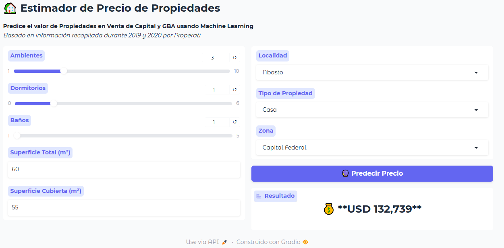

<<<<<<< HEAD
---
title: Estimador de Precio de Propiedades
emoji: 🏡
colorFrom: blue
colorTo: green
sdk: gradio
sdk_version: 5.9.1
app_file: app.py
pinned: false
---

# 🏡 Predictor de Precios Inmobiliarios

Esta aplicación permite estimar el precio de una propiedad en USD a partir de sus características principales (cantidad de ambientes, dormitorios, baños, superficie total, superficie cubierta, tipo de propiedad, localidad y zona).

La interfaz fue desarrollada con **Gradio** y el modelo fue entrenado previamente con datos históricos del mercado inmobiliario argentino.

## 🚀 Link a la app

👉 [Abrir la aplicación en Hugging Face Spaces](https://huggingface.co/spaces/Mara1989/predictor-precios-inmuebles)

## 🖼️ Captura de pantalla

## 🧠 Ejemplo de uso del endpoint

# instalar gradio_client antes de procesar (pip istall gradio_client)

from gradio_client import Client

client = Client("Mara1989/predictor-precios-inmuebles")
result = client.predict(
		rooms=3,
		bedrooms=1,
		bathrooms=1,
		surface_total=60,
		surface_covered=55,
		place_name="Abasto",
		property_type="Casa",
		state_name="Capital Federal",
		api_name="/predict_price"
)
print(result)
=======
---
title: Estimador de Precio de Propiedades
emoji: 🏡
colorFrom: blue
colorTo: green
sdk: gradio
sdk_version: 5.9.1
app_file: app.py
pinned: false
---

# 🏡 Predictor de Precios Inmobiliarios

Esta aplicación permite estimar el precio de una propiedad en USD a partir de sus características principales (cantidad de ambientes, dormitorios, baños, superficie total, superficie cubierta, tipo de propiedad, localidad y zona).

La interfaz fue desarrollada con **Gradio** y el modelo fue entrenado previamente con datos históricos del mercado inmobiliario argentino.

## 🚀 Link a la app

👉 [Abrir la aplicación en Hugging Face Spaces](https://huggingface.co/spaces/Mara1989/predictor-precios-inmuebles)

## 🖼️ Captura de pantalla

## 🧠 Ejemplo de uso del endpoint

>>>>>>> 03d283f17710b30a873a51b2b504ebc7c6978069
